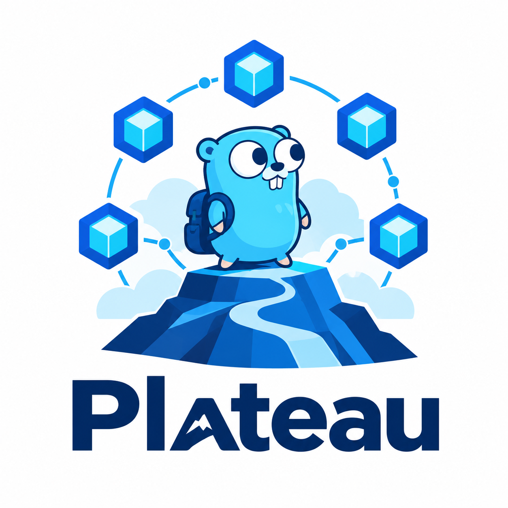

  

<h1 align="center">Plateau</h1>

  构造像高原一样稳固强大的微服务

简体中文

> 本项目是 [Servora](https://github.com/Servora-Kit/servora) 框架的最佳实践

`plateau` 当前包含具体 JWT AuthN、OpenFGA AuthZ、JWT/OpenFGA 基础能力、安全 Proto/codegen、IAM 微服务、Audit 微服务、Example CRUD 服务及其 Web 入口。

## 微服务

- **IAM**（`app/iam/service/`）：IAM 微服务
  - 为 Plateau 整个平台所有微服务提供中性化认证授权服务

- **Example**（`app/example/service/`）：Servora CRUD 生态示例服务
  - 是 servora 的经典用法，也是官方推荐的代码布局

- **Audit**（`app/audit/service/`）：全链路审计日志服务
  - 基于 Kafka 消费审计事件
  - ClickHouse 持久化存储
  - 审计日志查询 API
